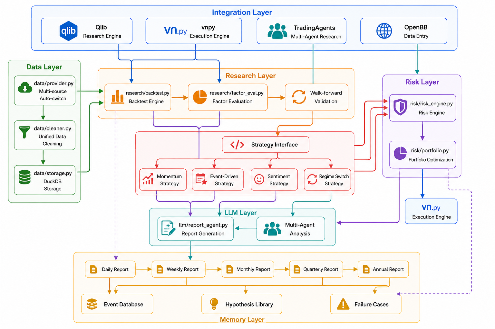
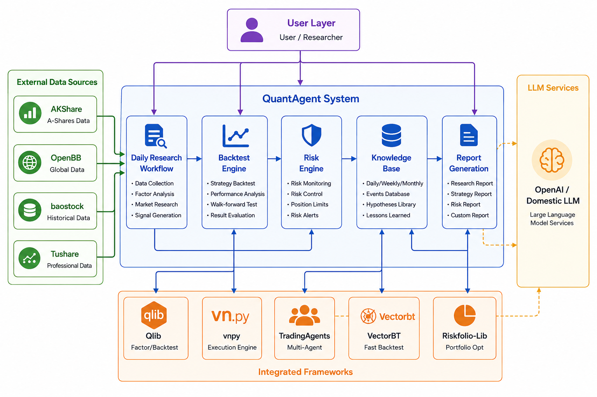
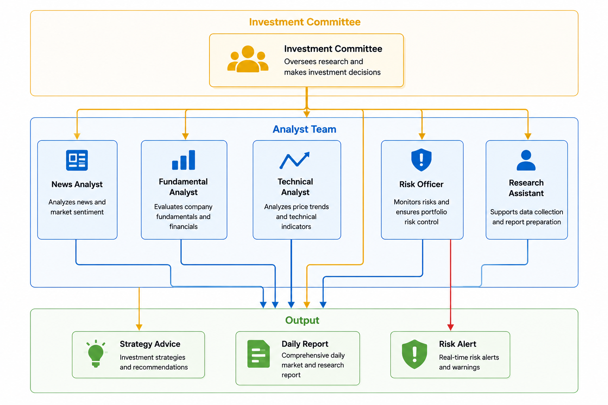

# 🤖 QuantAgent: The AI-Powered Quant Research Lab

> **Where LLMs are Researchers, not Traders.**
>
> A production-ready framework integrating Qlib, vn.py, and MCP + Skill Architecture for systematic trading research.

[](https://python.org)
[](LICENSE)
[](https://github.com/Aurora-73/QuantAgent)
[](https://github.com/Aurora-73/QuantAgent)
[](https://github.com/Aurora-73/QuantAgent)
[](https://github.com/Aurora-73/QuantAgent/issues)

🌐 **Chinese Version**: [README.md](README.md)

---

**Core Philosophy** 🔭 : Traditional quantitative engines handle trade execution, while LLM handles information processing and research assistance. **Never let AI directly decide trades**, eliminating hallucination risks.

---

## 🎯 Why QuantAgent?

Five major pain points in quantitative development, solved by one project:

| Pain Point | Solution |
|------------|----------|
| 📊 Data source chaos | Multi-source auto-switching (AKShare/baostock/pytdx), unified data cleaning |
| 🔬 Difficult backtesting | Qlib + VectorBT dual engine, Walk-forward validation |
| 🤖 Inconsistent live trading interfaces | vn.py unified execution interface, supporting CTP/IB |
| 🧠 AI hallucination risk | LLM only does research, not trading, strict permission separation |
| 📝 Tedious research workflow | Multi-Agent team collaboration, auto-generate daily/weekly reports |

---

## ✨ Core Features

| 🛡️ Robust Infrastructure | 🧠 AI Research Team | 📈 Strategy Ready |
|--------------------------|-------------------|------------------|
| **Multi-source Data**: Auto-switch AKShare/baostock/pytdx | **Daily Reports**: Auto-generate Markdown reports (Daily/Weekly) | **Modular Strategies**: Momentum, Event-driven, Sentiment |
| **DuckDB Storage**: Lightning-fast historical data storage | **Multi-Agent Debate**: Bull vs. Bear debate modules | **Risk-First**: Circuit breaker, position sizing, concentration limits |
| **Qlib Integration**: State-of-the-art factor analysis & backtest | **Knowledge Graph**: Archive failures, events, and lessons learned | **Walk-forward**: In-sample/Out-of-sample validation |
| **MCP Protocol**: Standardized interface for external agents | **Skill Workflows**: Business process guidance for agents | **vn.py Execution**: Unified live trading interface |

---

## 🏗️ System Architecture

### Core Business Architecture



### System Context Diagram



### Agent Team Collaboration Architecture



---

## 🤖 The "Right" Place for LLMs

In QuantAgent, we enforce a strict separation of powers.

| ✅ LLM as the Analyst | ❌ LLM as the Trader |
|----------------------|---------------------|
| Technical/Fundamental Analysis | Directly generating buy/sell signals |
| News Sentiment Summarization | Managing real-time order execution |
| Generating Investment Hypotheses | Calculating precise position sizes |
| Writing Daily Research Reports | Handling risk circuit breakers |

**LLM is a researcher, not a trader.** This ensures high productivity without compromising on safety.

---

## 🚀 One Command to Rule Them All

One-click installation, automatic configuration of virtual environment, dependencies, and directory structure.

### Prerequisites

- Python 3.10+
- Git

### One-Click Installation (Recommended)

```bash
# Clone the project
git clone https://github.com/Aurora-73/QuantAgent.git
cd QuantAgent

# Cross-platform one-click installation
python scripts/install.py
```

The script automatically completes:

1. ✅ Environment check (Python/Git)
2. ✅ Create virtual environment (auto-detect and fix platform mismatch)
3. ✅ Install core dependencies (requirements.txt)
4. ✅ Create config file (configs/.env)
5. ✅ Create necessary directories (data/, logs/, knowledge/)
6. ✅ Verify installation (run verify_project.py)

### Manual Installation

```bash
# Create virtual environment
python -m venv .venv
source .venv/bin/activate    # Linux/macOS
.venv\Scripts\activate       # Windows

# Install dependencies
pip install -r requirements.txt

# Configure API Key
cp configs/.env.example configs/.env
# Edit configs/.env and fill in necessary API keys
```

### Optional Dependencies

| Module | Command | Description |
|--------|---------|-------------|
| Qlib | `pip install qlib` | Research core, factor analysis/backtest |
| vnpy | `pip install ta-lib vnpy vnpy-ctp` | Execution engine, live trading |
| OpenBB | `pip install openbb` | Global data sources |

---

## 📁 Directory Structure

```
quant-system/
├── QuantAgent/                # Main code repository
│   ├── data/                  # Data layer
│   │   ├── provider.py        # Data acquisition
│   │   ├── storage.py         # DuckDB storage
│   │   └── cleaner.py         # Data cleaning
│   ├── strategies/            # Strategy layer
│   │   ├── base/              # Strategy base class
│   │   ├── momentum/          # Momentum strategy
│   │   ├── event_driven/      # Event-driven strategy
│   │   └── sentiment/         # Sentiment strategy
│   ├── research/              # Research layer
│   │   ├── backtest.py        # Backtest engine
│   │   └── factor_eval.py     # Factor evaluation
│   ├── risk/                  # Risk layer
│   │   ├── risk_engine.py     # Risk engine
│   │   └── portfolio.py       # Portfolio optimization
│   ├── knowledge/             # Memory layer
│   │   └── knowledge_base.py  # Hierarchical memory system
│   ├── integrations/          # Integration layer
│   │   ├── qlib_engine.py     # Qlib integration
│   │   ├── vnpy_engine.py     # vnpy integration
│   │   └── openbb_data.py     # OpenBB integration
│   ├── mcp_server/            # MCP server
│   │   ├── server.py          # MCP Server entry
│   │   ├── tools_data.py      # Data tools
│   │   └── tools_risk.py      # Risk tools
│   ├── .claude/skills/        # Skill workflows
│   ├── configs/               # Configuration files
│   └── monitoring/            # Monitoring layer
├── examples/                  # Usage examples
├── tests/                     # Unit tests
├── scripts/                   # Script entry points
├── docs/                      # Documentation
├── requirements.txt           # Dependencies
├── pyproject.toml             # Project configuration
└── LICENSE                    # License
```

---

## 🎮 Run Examples

```bash
# Quick start: Get data and run backtest
python examples/00_quick_start.py

# Get stock data
python examples/01_get_data.py --ticker 600519 --start 2025-01-01

# Calculate factors
python examples/02_calc_factors.py

# Run backtest
python examples/03_backtest.py --strategy momentum

# Use knowledge base
python examples/04_knowledge.py
```

### Daily Research Workflow

```bash
# Run daily research
python -m scripts daily-research

# Run backtest
python -m scripts backtest --strategy momentum --ticker 600519 --start 2025-01-01

# Health check
python -m scripts health_check

# List all MCP tools
python -m mcp_server.server --list-tools
```

---

## 🧪 Run Tests

```bash
# Run all tests
pytest

# Run specific module tests
pytest tests/test_risk_engine.py -v

# Run strategy-related tests
pytest tests/test_momentum_strategy.py -v

# Generate coverage report
pytest --cov=quant_system --cov-report=html
```

---

## 🌐 Open Source Project Integrations

| Project | Purpose | Integration Method | Integration Module |
|---------|---------|-------------------|-------------------|
| **Qlib** | Research core | Direct import | `integrations/qlib_engine.py` |
| **vnpy** | Execution core | Direct import | `integrations/vnpy_engine.py` |
| **AKShare** | A-Shares data | pip install | `data/provider.py` |
| **OpenBB** | Global data sources | pip install | `integrations/openbb_data.py` |
| **Riskfolio-Lib** | Portfolio optimization | pip install | `risk/portfolio.py` |
| **VectorBT** | Fast backtest | pip install | `research/backtest.py` |

---

## 📊 Core Modules

### Strategy Interface (Must implement for each strategy)

```python
class StrategyBase(ABC):
    prepare_features()          # Prepare features
    generate_signal()           # Generate signals
    position_sizing()           # Position sizing
    risk_check()                # Risk check
    expected_holding_period()   # Expected holding period
    kill_switch_condition()     # Circuit breaker condition
```

### MCP Tools Overview

Standardized MCP tools for external Agent calls. Run `python -m mcp_server.server --list-tools` for the full list:

- **Data Tools**: get_quote, get_history, get_factors, get_sector_stocks, update_data, ...
- **Risk & Strategy Tools**: run_backtest, run_stress_test, run_brinson_attribution, ...
- **Knowledge Tools**: search_events, wiki_search, get_daily_report, ...

### Skill Workflows

7 business process guides to tell Agent "what to do first, what to do next":

| Skill | Purpose |
|-------|---------|
| sector-screening | Industry/concept sector stock screening |
| daily-workflow | Daily research workflow |
| backtest-workflow | Strategy backtesting workflow |
| risk-assessment | Risk assessment workflow |
| factor-research | Factor research workflow |
| knowledge-exploration | Knowledge exploration workflow |
| market-quick-check | Market quick check |

---

## 🗺️ Development Roadmap

### Phase 1: Research + Reporting + Review ✅

- [x] Data integration (AKShare + OpenBB)
- [x] Qlib research engine integration
- [x] Factor calculation and evaluation
- [x] VectorBT backtesting
- [x] Knowledge base (events/hypotheses/lessons)
- [x] Daily/Weekly/Monthly report generation
- [x] Riskfolio-Lib portfolio optimization
- [x] Risk engine
- [x] Monitoring and alerts

### Phase 2: Signal Engine + Backtesting ⚡

- [x] Strategy plugin interface
- [x] Momentum strategy implementation
- [x] Event-driven strategy
- [x] MCP server
- [x] Skills workflow layer
- [ ] Walk-forward validation

### Phase 3: Extensible + High Performance + Security 🛡️

- [ ] MCP tool auto-discovery
- [ ] DuckDB query optimization
- [ ] Factor calculation I/O optimization
- [ ] Write tool dry-run
- [ ] Financial data integration

### Phase 4: Simulation & Live Trading 📈

- [ ] vnpy simulated trading
- [ ] Slippage and execution monitoring
- [ ] vnpy CTP/IB connection
- [ ] Risk circuit breaker mechanism

---

## 🤝 Contributing

Welcome to submit Issues and Pull Requests! Please follow these guidelines:

### How to Contribute

1. Fork the project
2. Create a feature branch (`git checkout -b feature/foo`)
3. Commit your changes (`git commit -am 'Add foo'`)
4. Push to the branch (`git push origin feature/foo`)
5. Create a Pull Request

### 🌟 Good First Issues

These tasks are perfect for new contributors:

- 📊 **Add a new data source adapter** - Add new data source adapters (e.g., Tushare, JoinQuant), refer to `data/provider.py`
- 📈 **Implement a new strategy** - Implement new strategies (e.g., reversal, mean reversion), refer to `strategies/base/`
- 🧪 **Add unit tests** - Add unit tests for data layer or strategy layer
- 📖 **Improve documentation** - Improve MCP tool documentation or Skill workflow documentation
- 🔌 **Add new MCP tool** - Add new MCP tools, refer to `mcp_server/tools_data.py`

### Development Standards

- Code formatting: Black + Ruff
- Testing framework: pytest
- Commit messages: Conventional Commits format

### Issue Templates

We provide two Issue templates:

- **Data Source Request** - Request new data sources
- **Strategy Sharing** - Share your strategy ideas or code

---

## 📝 License

This project is licensed under the MIT License - see the [LICENSE](LICENSE) file for details.

---

## 🙋‍♂️ Communication & Feedback

- 🐛 **Bug Reports**: Submit Issue with reproduction steps
- 💡 **Feature Requests**: Submit Feature Request
- 📖 **Documentation Issues**: Submit Issue or directly modify docs/ directory
- 💬 **Discussions**: Welcome to discuss strategies and usage in GitHub Discussions

---

**LLM doesn't predict price movements; LLM improves the efficiency and quality of the entire research pipeline!** 🚀

⭐ If this project helps you, please give it a Star! Your support is our driving force for continuous improvement!