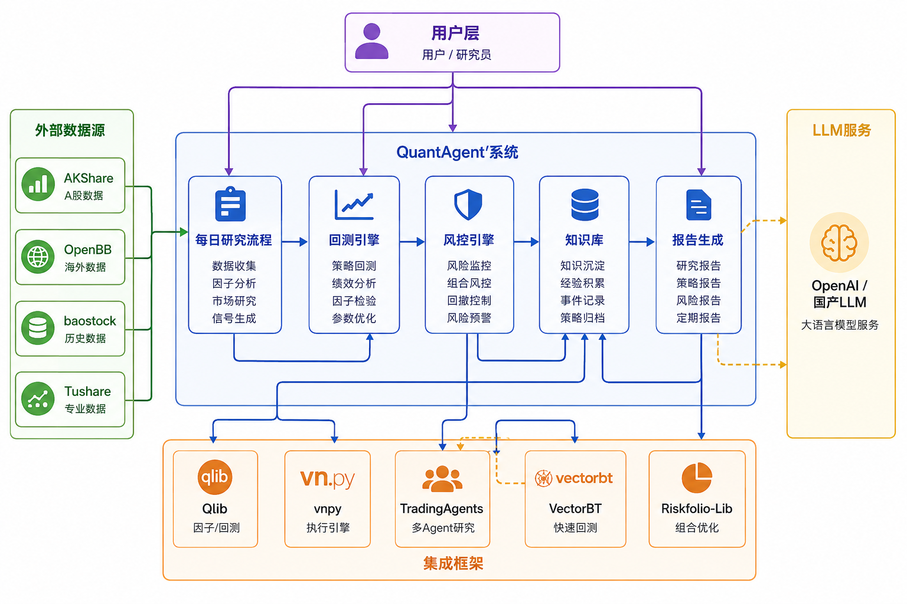
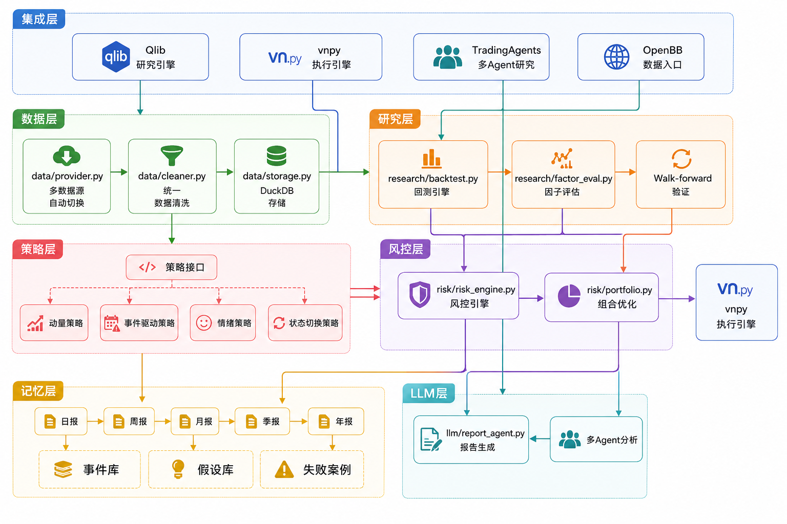
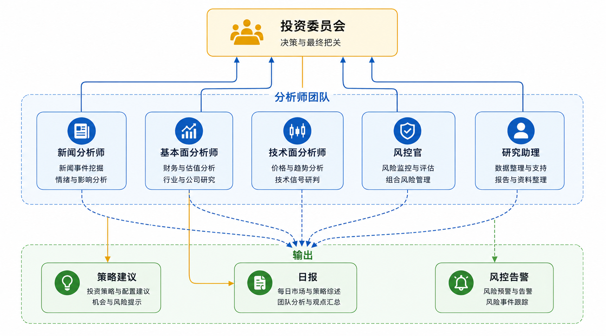

# QuantAgent — AI 辅助量化交易研究系统

> **核心原则**：传统量化引擎做交易主干，LLM 只做研究和信息处理，不直接决定下单。
> **设计方法**：站在巨人肩膀上，直接集成已有开源项目，只写必要的胶水层。

[](https://python.org)
[](LICENSE)
[](https://github.com/Aurora-73/QuantAgent)

🌐 **English Version**: [README.en.md](README.en.md)

## 📖 项目简介

QuantAgent 是一个**个人可实现的 Agent 基金公司**，通过多 Agent 团队协作，自动化完成量化交易研究的全流程：

- **数据层**：多数据源自动切换（AKShare/baostock/pytdx），统一数据清洗
- **研究层**：因子分析、策略回测、Walk-forward 验证
- **策略层**：插件化架构，支持动量、事件驱动、情绪分析等策略
- **风控层**：系统化风控引擎，单票限制、行业集中度、回撤熔断
- **记忆层**：层级记忆系统（日报→周报→月报→季报→年报）
- **LLM 辅助**：多 Agent 研究团队（新闻/基本面/技术面/风控/研究助理）

## 🏗️ 系统架构

### 系统上下文图



### 核心业务架构



### Agent 团队协作架构



## 📁 目录结构

```
quant-system/
├── quant_system/              # 核心源码包
│   ├── data/                  # 数据层
│   │   ├── provider.py        # 数据获取
│   │   ├── storage.py         # DuckDB存储
│   │   └── cleaner.py         # 数据清洗
│   ├── strategies/            # 策略层
│   │   ├── base/              # 策略基类
│   │   ├── momentum/          # 动量策略
│   │   ├── event_driven/      # 事件驱动策略
│   │   └── sentiment/         # 情绪策略
│   ├── research/              # 研究层
│   │   ├── backtest.py        # 回测引擎
│   │   └── factor_eval.py     # 因子评估
│   ├── risk/                  # 风控层
│   │   ├── risk_engine.py     # 风控引擎
│   │   └── portfolio.py       # 组合优化
│   ├── knowledge/             # 记忆层
│   │   └── knowledge_base.py  # 层级记忆系统
│   ├── llm/                   # LLM层
│   │   └── report_agent.py    # 报告生成Agent
│   ├── integrations/          # 集成层
│   │   ├── qlib_engine.py     # Qlib集成
│   │   ├── vnpy_engine.py     # vnpy集成
│   │   ├── trading_agents.py  # TradingAgents集成
│   │   └── openbb_data.py     # OpenBB集成
│   ├── configs/               # 配置文件
│   └── monitoring/            # 监控层
├── examples/                  # 使用示例
│   ├── 00_quick_start.py      # 快速开始
│   ├── 01_get_data.py         # 数据获取
│   ├── 02_calc_factors.py     # 因子计算
│   ├── 03_backtest.py         # 回测演示
│   ├── 04_knowledge.py        # 知识库演示
│   └── 05_llm_analysis.py     # LLM分析演示
├── tests/                     # 单元测试
├── scripts/                   # 脚本入口
├── docs/                      # 文档
│   ├── getting-started/       # 快速上手
│   ├── development/           # 开发指南
│   ├── research/              # 研究方法
│   ├── operations/            # 运维文档
│   ├── reference/             # 参考文档
│   └── project/               # 项目管理
├── requirements.txt           # 依赖列表
├── pyproject.toml             # 项目配置
└── LICENSE                    # 许可证
```

## 🚀 快速开始

### 环境要求

- Python 3.10+
- Git

### 一键安装（推荐）

**跨平台（推荐）：**

```bash
python scripts/install.py
```

**Windows（PowerShell）：**

```powershell
powershell -ExecutionPolicy Bypass -File scripts/install_windows.ps1
```

**Linux/Mac（Bash）：**

```bash
bash scripts/install.sh
```

脚本会自动完成：

1. ✅ 环境检查（Python/Git）
2. ✅ 创建虚拟环境（自动检测并修复平台不匹配问题）
3. ✅ 安装核心依赖（requirements.txt）
4. ✅ 创建配置文件（configs/.env）
5. ✅ 创建必要目录（data/, logs/, knowledge/）
6. ✅ 验证安装（运行 verify\_project.py）

### 手动安装

```bash
# 克隆项目
git clone https://github.com/quantagent/quant-system.git
cd quant-system

# 创建虚拟环境
python -m venv .venv
source .venv/bin/activate    # Linux/macOS
.venv\Scripts\activate       # Windows

# 安装依赖
pip install -r requirements.txt

# 配置 API Key
cp configs/.env.example configs/.env
# 编辑 configs/.env，填入必要的 API Key
```

### 可选依赖安装

| 模块     | 命令                                 | 说明            |
| ------ | ---------------------------------- | ------------- |
| Qlib   | `pip install qlib`                 | 研究层核心，因子分析/回测 |
| vnpy   | `pip install ta-lib vnpy vnpy-ctp` | 执行引擎，实盘交易     |
| OpenBB | `pip install openbb`               | 海外数据源         |

### 运行示例

```bash
# 快速开始：获取数据并运行回测
python examples/00_quick_start.py

# 获取股票数据
python examples/01_get_data.py --ticker 600519 --start 2025-01-01

# 计算因子
python examples/02_calc_factors.py

# 运行回测
python examples/03_backtest.py --strategy momentum

# 使用知识库
python examples/04_knowledge.py

# LLM 分析
python examples/05_llm_analysis.py
```

### 每日研究流程

```bash
# 运行每日研究（不含 LLM）
python -m scripts daily-research --no-llm

# 运行回测
python -m scripts backtest --strategy momentum --ticker 600519 --start 2025-01-01

# 健康检查
python -m scripts health_check
```

## 🤖 LLM 的正确位置

```
✅ 合适 (通过 TradingAgents)         ❌ 不合适
─────────────────────────────────────────────────
技术面分析 (Market Analyst)           直接决定买卖
基本面分析 (Fundamentals Analyst)     直接生成仓位
情绪面分析 (Sentiment Analyst)        替代风控规则
新闻分析 (News Analyst)              替代组合优化器
多空辩论 (Bull/Bear Debate)          替代执行引擎
风控辩论 (Risk Debate)               无约束的自由决策
```

**一句话：LLM 是研究员，不是交易员。**

## 🧪 运行测试

```bash
# 运行所有测试
pytest

# 运行指定模块测试
pytest tests/test_risk_engine.py -v

# 运行策略相关测试
pytest tests/test_momentum_strategy.py -v

# 生成覆盖率报告
pytest --cov=quant_system --cov-report=html
```

## 🌐 开源项目集成

| 项目                | 用途          | 集成方式        | 集成模块                             |
| ----------------- | ----------- | ----------- | -------------------------------- |
| **Qlib**          | 研究层核心       | 直接 import   | `integrations/qlib_engine.py`    |
| **vnpy**          | 执行层核心       | 直接 import   | `integrations/vnpy_engine.py`    |
| **TradingAgents** | LLM多Agent研究 | 直接 import   | `integrations/trading_agents.py` |
| **OpenBB**        | 数据入口        | 直接 import   | `integrations/openbb_data.py`    |
| **Riskfolio-Lib** | 组合优化        | pip install | `risk/portfolio.py`              |
| **VectorBT**      | 快速回测        | pip install | `research/backtest.py`           |
| **AKShare**       | A股数据        | pip install | `data/provider.py`               |

## 📊 核心模块

### 策略接口 (每个策略必须实现)

```python
class StrategyBase(ABC):
    prepare_features()          # 准备特征
    generate_signal()           # 生成信号
    position_sizing()           # 仓位计算
    risk_check()                # 风控检查
    expected_holding_period()   # 预期持仓周期
    kill_switch_condition()     # 熔断条件
```

### 知识库结构

```
knowledge/
  daily/          日报 (Markdown)
  weekly/         周报
  monthly/        月报
  quarterly/      季报
  annual/         年报
  events/         事件数据库 (JSONL)
  hypotheses/     假设库
  failures/       失败案例
```

## 🗺️ 开发路线

### Phase 1: 研究 + 报告 + 复盘 ✅

- [x] 数据接入 (AKShare + OpenBB)
- [x] Qlib 研究引擎集成
- [x] 因子计算与评估
- [x] VectorBT 回测
- [x] 知识库 (事件/假设/教训)
- [x] 日报/周报/月报生成
- [x] Riskfolio-Lib 组合优化
- [x] 风控引擎
- [x] 监控告警
- [x] TradingAgents 多Agent集成

### Phase 2: 信号引擎 + 回测 ⚡

- [x] 策略插件接口
- [x] 动量策略实现
- [ ] Qlib LightGBM 模型训练
- [ ] Walk-forward 验证

### Phase 3: 仿真盘

- [ ] vnpy 模拟交易
- [ ] 滑点与成交监控
- [ ] 回测 vs 实盘偏差分析

### Phase 4: 小资金实盘

- [ ] vnpy CTP/IB 连接
- [ ] 风控熔断机制
- [ ] 实时监控告警

## 📝 License

This project is licensed under the MIT License - see the [LICENSE](LICENSE) file for details.

## 🙋‍♂️ Contributing

欢迎提交 Issue 和 Pull Request！请遵循以下规范：

1. Fork 项目
2. 创建功能分支 (`git checkout -b feature/foo`)
3. 提交更改 (`git commit -am 'Add foo'`)
4. 推送到分支 (`git push origin feature/foo`)
5. 创建 Pull Request

***

**AI 不负责猜涨跌，AI 负责提高整个研究链路的效率和质量！** 🚀